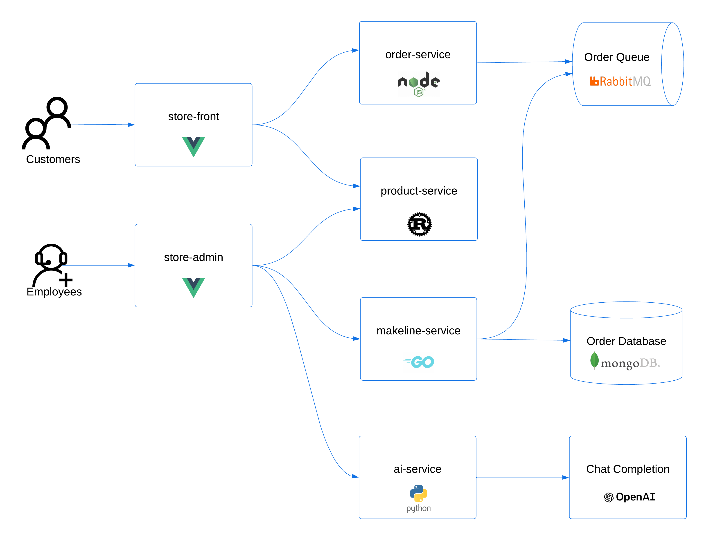
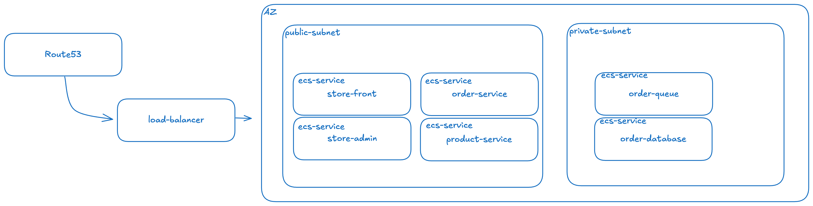

# AWS ECS Store Demo

This sample demo app consists of a group of containerized microservices that can be easily deployed into an AWS ECS (Elastic Container Service) environment. Originally, this repository was designed to run on Azure Kubernetes Service (AKS), but it has been modified to exemplify deployment in an AWS environment. This is meant to show a realistic scenario using a polyglot architecture, event-driven design, and common open-source back-end services (e.g., RabbitMQ, MongoDB). The application also leverages OpenAI's GPT-3 models to generate product descriptions. This can be done using either [Azure OpenAI](https://learn.microsoft.com/azure/ai-services/openai/overview) or [OpenAI](https://openai.com/).

This application is inspired by another demo app called [Red Dog](https://github.com/Azure/reddog-code).

> [!NOTE]
> This is not meant to be an example of perfect code to be used in production, but more about showing a realistic application running in AWS ECS.

> [!IMPORTANT]
> For testing purposes, all services will be deployed in containers without persistent storage. This will be addressed in a future version to ensure data persistence and reliability.

## Architecture

The application has the following services: 

| Service | Description |
| --- | --- |
| `makeline-service` | This service handles processing orders from the queue and completing them (Golang) |
| `order-service` | This service is used for placing orders (Javascript) |
| `product-service` | This service is used to perform CRUD operations on products (Rust) |
| `store-front` | Web app for customers to place orders (Vue.js) |
| `store-admin` | Web app used by store employees to view orders in queue and manage products (Vue.js) | 
| `virtual-customer` | Simulates order creation on a scheduled basis (Rust) |
| `virtual-worker` | Simulates order completion on a scheduled basis (Rust) |
| `ai-service` | Optional service for adding generative text and graphics creation (Python) |
| `mongodb` | MongoDB instance for persisted data |
| `rabbitmq` | RabbitMQ for an order queue |

